<!-- _class: lead -->

### **Construcción Incremental de Bases de Conocimiento Semi-estructuradas con Modelos de Lenguaje**

**Carlos Mauricio Reyes Escudero**
Junio de 2025

---

<!-- _header: Personal Knowledge Management -->
<!-- _footer: Linear Note-taking: Outline Method -->

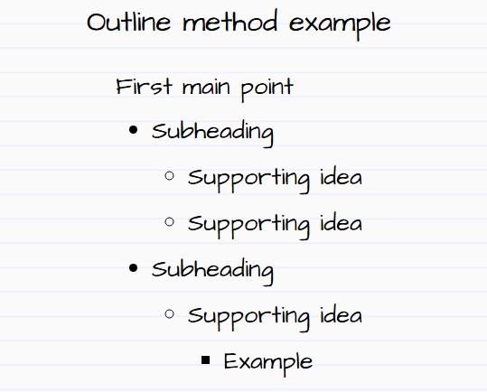

---

<!-- _header: Personal Knowledge Management -->
<!-- _footer: Linear Note-taking: Sentence Method -->

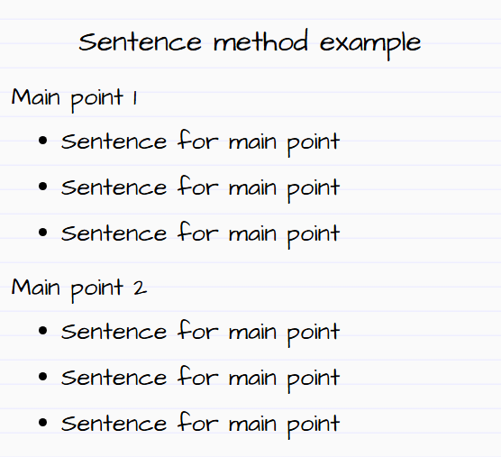

---

<!-- _header: Personal Knowledge Management -->
<!-- _footer: Non-Linear Note-taking: Charting -->

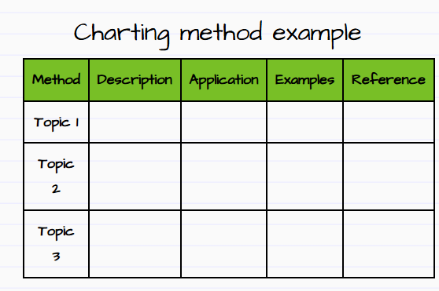

---

<!-- _header: Personal Knowledge Management -->
<!-- _footer: Non-Linear Note-taking: Mind Mapping -->

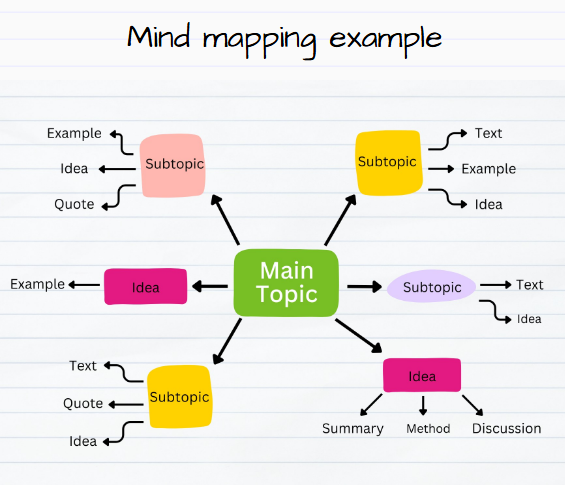

---

<!-- _header: Personal Knowledge Management -->
<!-- _footer: Note-taking: Cornell Notes -->

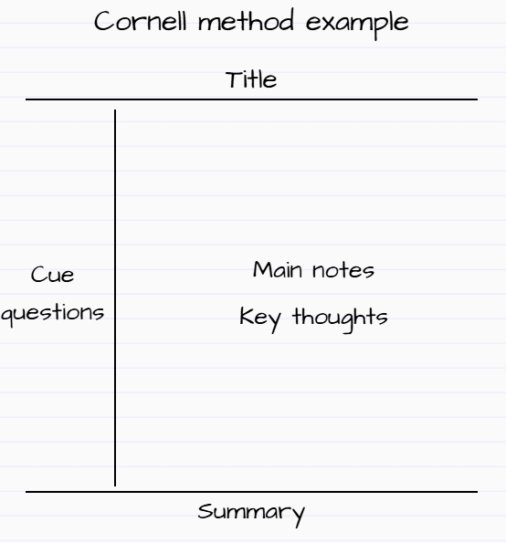

---

<!-- _header: Personal Knowledge Management -->
<!-- _footer: Org. Note-taking: Zettelkasten -->

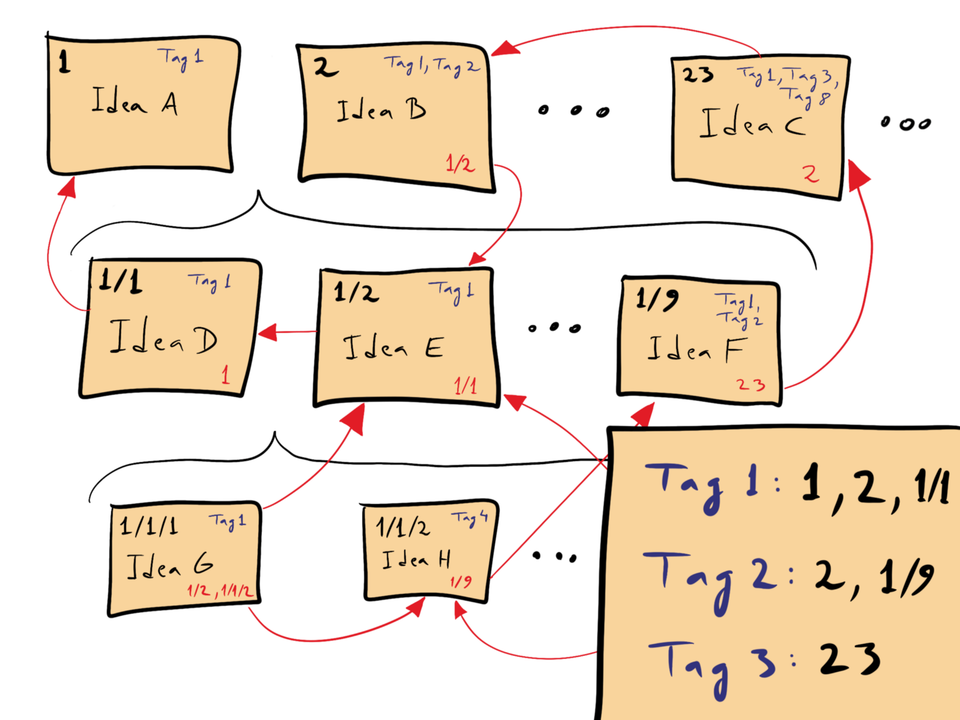

---

<!-- _header: Personal Knowledge Management -->
<!-- _footer: Org. Note-taking: P.A.R.A -->

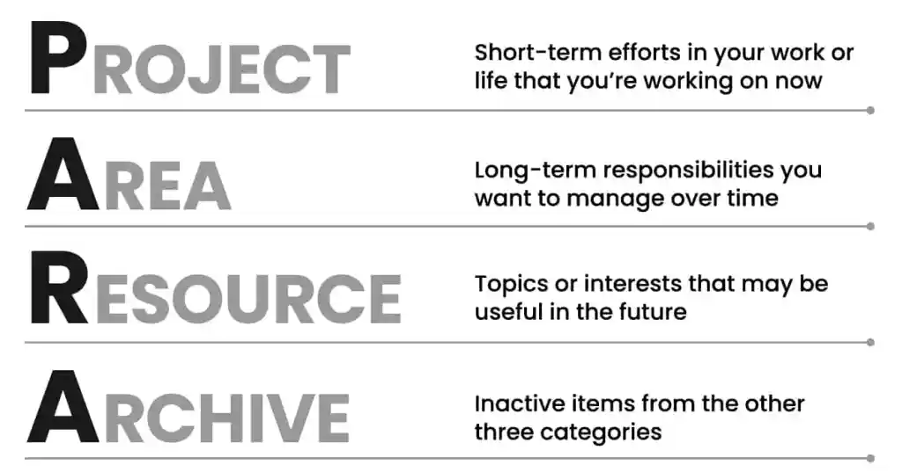

---

<!-- _header: Personal Knowledge Management -->
<!-- _footer: Personal Knowledge Base + Personal Knowledge Graph -->

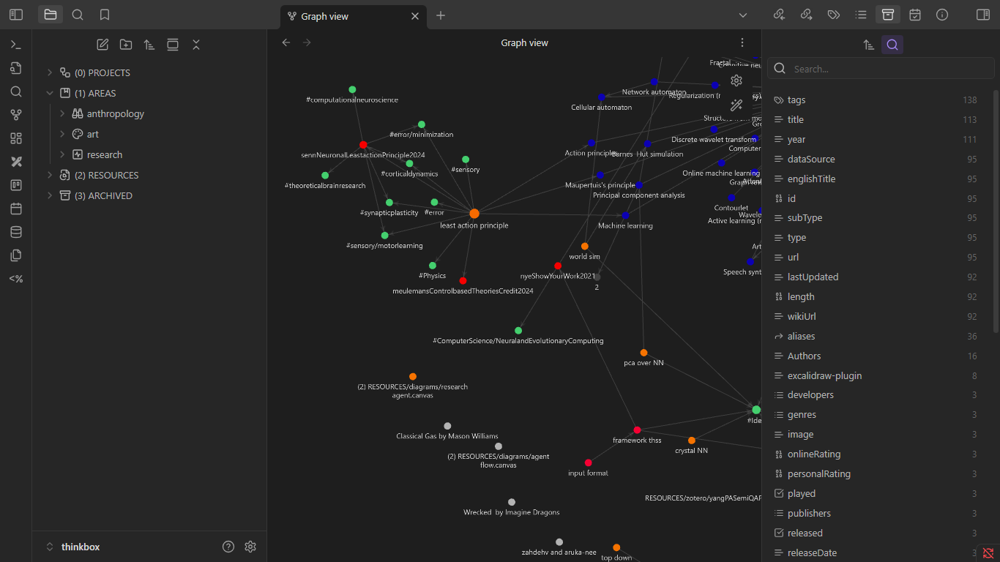

---

<!-- _header: The problem -->
<!-- _footer: Laborious process of integrating new knowledge to a knowledge base -->

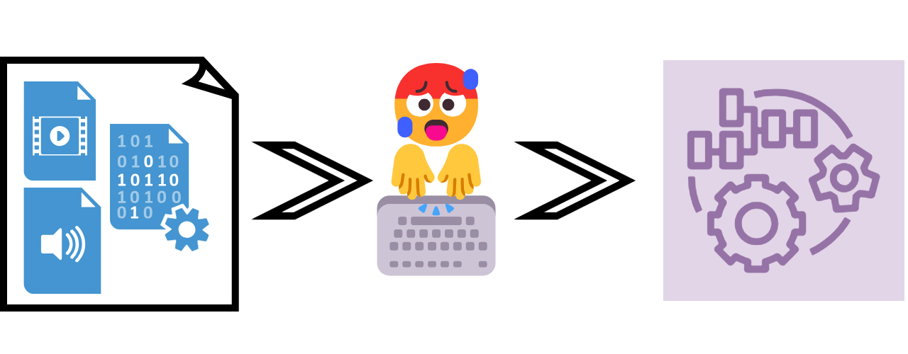

---

<!-- _class: invert -->

<!-- _header: The context -->
<!-- _footer: What we have -->

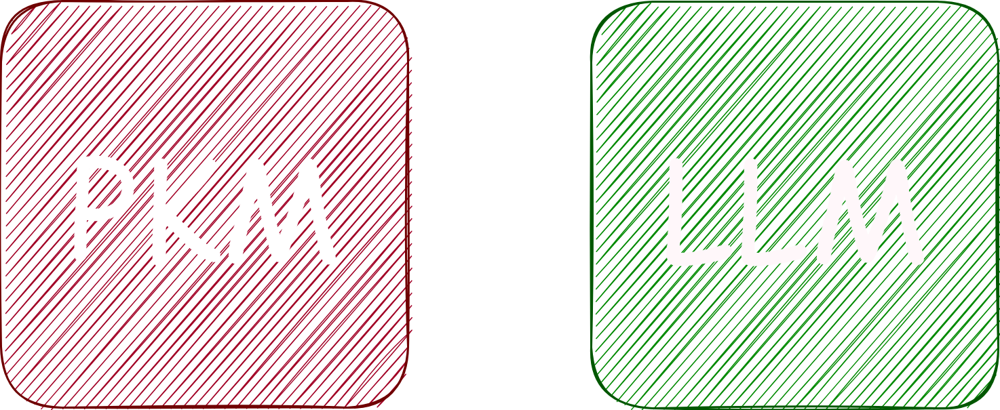

---

<!-- _class: invert -->

<!-- _header: The context -->
<!-- _footer: What we want -->

---

<!-- _class: invert -->

# `lImporter`

Un agente autónomo para _Obsidian.md_

---

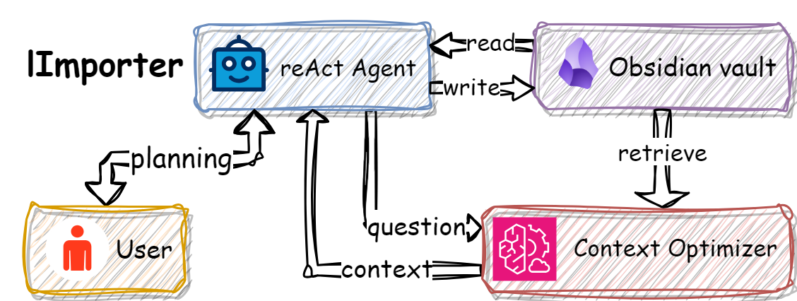

---

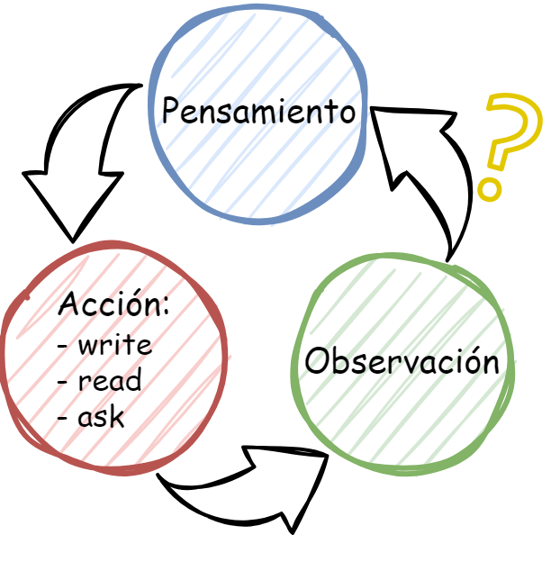

---

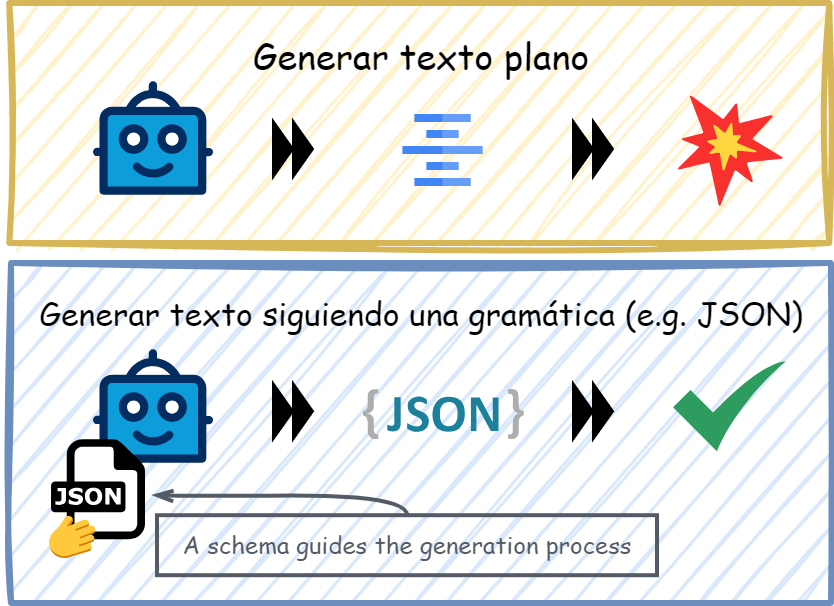

---

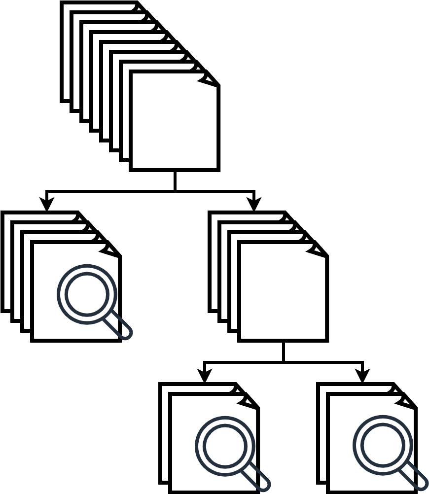

---

<!-- _class: invert -->

# Ejemplos

---

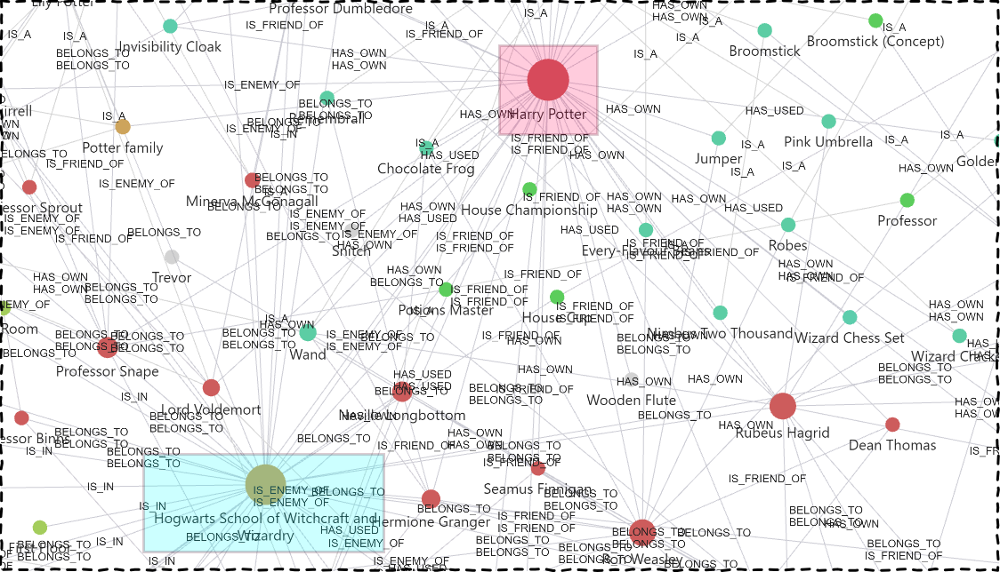

---

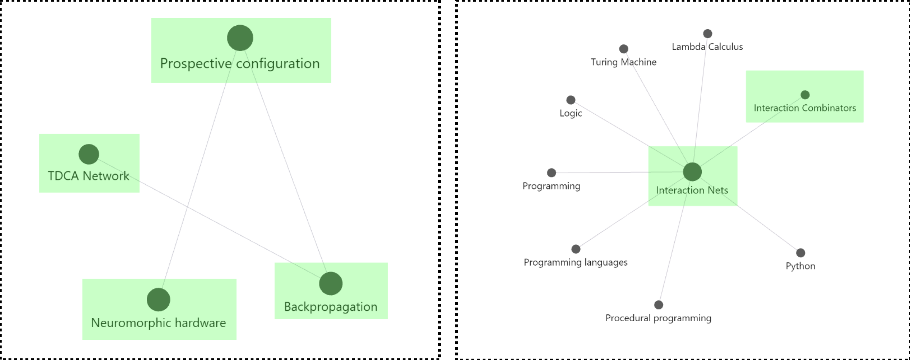

---

---

---

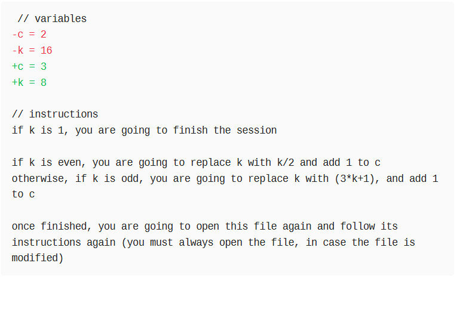

---

---

---

---

<!-- _class: invert -->

# Gracias.

## ¿Preguntas?