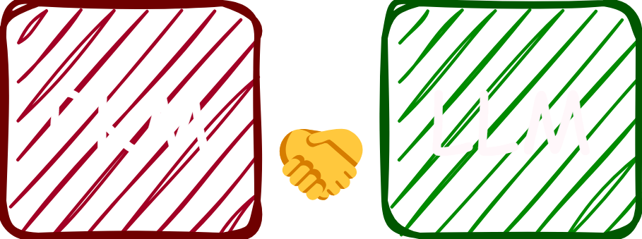

<!-- _class: lead -->

### **Construcción Incremental de Bases de Conocimiento Semi-estructuradas con Modelos de Lenguaje**

**Carlos Mauricio Reyes Escudero**
Junio de 2025

---

<!-- _footer: 'El Contexto' -->

<!-- _class: invert -->

 

---

<!-- _footer: 'El Problema' -->

---

<!-- _class: invert -->

# `lImporter`

Un agente autónomo para _Obsidian.md_

---

<!-- _footer: 'Arquitectura' -->

---

<!-- _footer: 'Pilar 1: El Agente' -->

---

<!-- _footer: 'Pilar 2: La Interacción' -->

<!-- Nota: Crea un diagrama: [LLM] -> flecha -> [Texto Caótico] (con una X roja encima). Luego [LLM] -> flecha 'Function Calling' -> [Bloque de código JSON limpio] (con un tick verde). -->

---

<!-- _footer: 'Pilar 3: El Contexto' -->

<!-- Nota: Crea un diagrama: [Documento Grande] -> se divide en [3 Documentos Pequeños]. De cada uno sale una flecha a una [Bombilla/Idea]. Las 3 bombillas se unen en una [Bombilla Grande/Resumen]. -->

---

<!-- _class: invert -->

# Ejemplos

---

<!--  -->

---

<!-- _footer: 'Resultado 3: Productividad Real' -->

<!-- Nota: Une las figuras 3.3A y 3.3B en una sola imagen comparativa. -->

---

<!-- _footer: 'Resultado 4: Memoria Externa' -->

---

<!-- _class: invert -->

## Trabajo Futuro

- LLMs Locales / Open-Source
- Agentes Proactivos
- Integración con Ecosistema (Dataview)
- Sistemas Multi-Agente

---

<!-- _class: invert -->

# Gracias.

## ¿Preguntas?