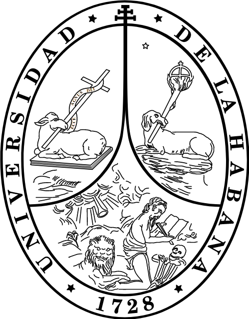
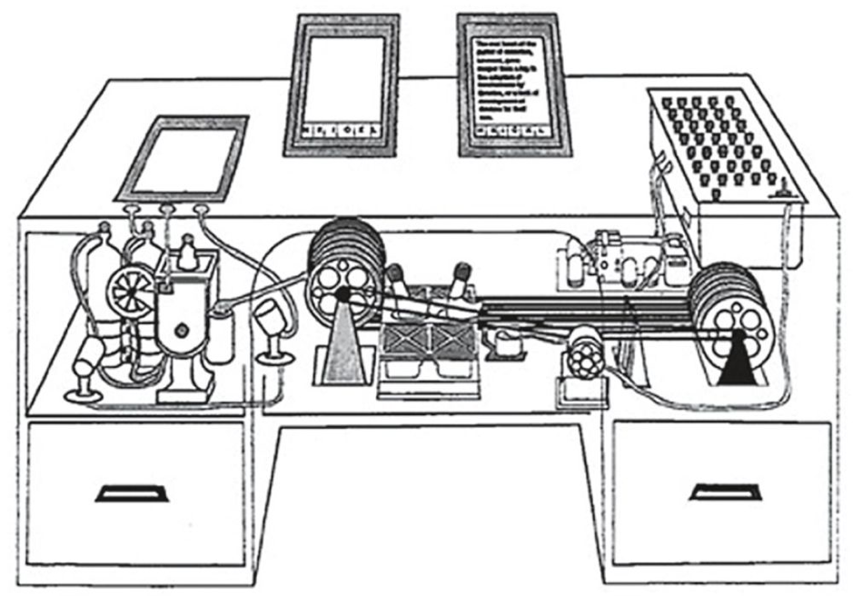
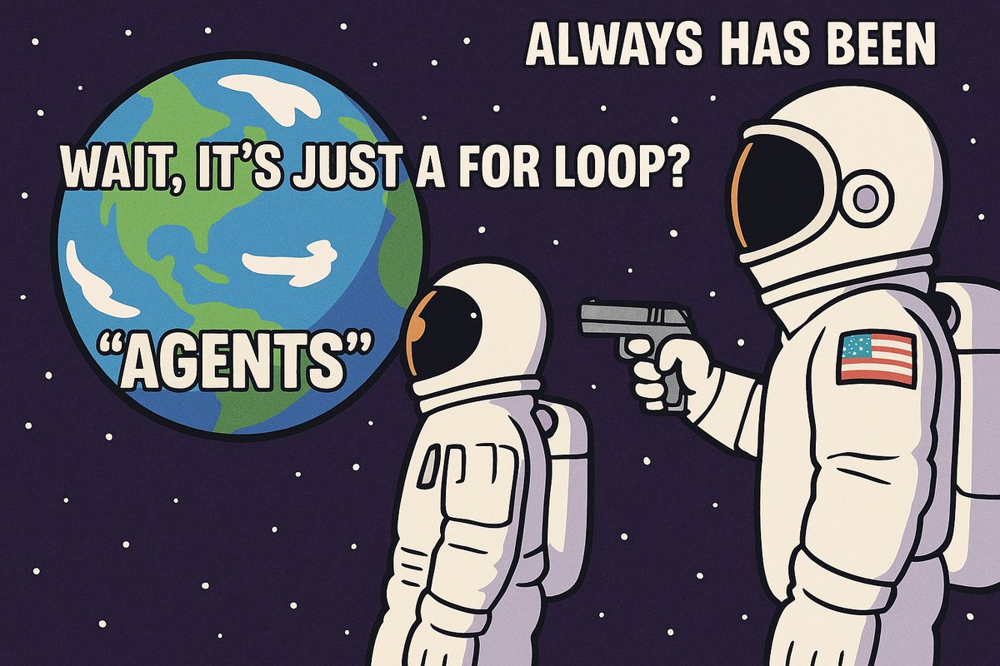
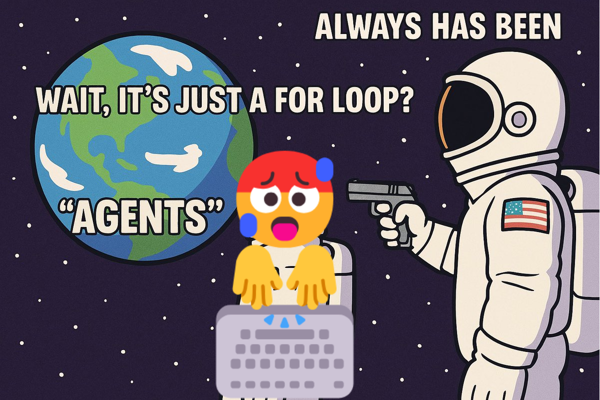

<!-- _class: lead -->

### Construcción Incremental de **Bases de Conocimiento** Semi-estructuradas con **Modelos de Lenguaje**

**Carlos Mauricio Reyes Escudero**
Junio de 2025

---

<!-- _header: Personal Knowledge Management -->
<!-- _footer: Linear Note-taking: Outline Method -->

---

<!-- _header: Personal Knowledge Management -->
<!-- _footer: Linear Note-taking: Sentence Method -->

---

<!-- _header: Personal Knowledge Management -->
<!-- _footer: Non-Linear Note-taking: Charting -->

---

<!-- _header: Personal Knowledge Management -->
<!-- _footer: Non-Linear Note-taking: Mind Mapping -->

---

<!-- _header: Personal Knowledge Management -->
<!-- _footer: Note-taking: Cornell Notes -->

---

<!-- _header: Personal Knowledge Management -->
<!-- _footer: Org. Note-taking: Zettelkasten -->

---

<!-- _header: Personal Knowledge Management -->
<!-- _footer: Org. Note-taking: P.A.R.A -->

---

<!-- _header: Personal Knowledge Management -->
<!-- _footer: The Memex -->

---

<!-- _header: Personal Knowledge Management -->
<!-- _footer: Personal Knowledge Base + Personal Knowledge Graph -->

---

<!-- _header: The problem -->
<!-- _footer: Laborious process of integrating new knowledge to a knowledge base -->

---

<!-- _header: Large Language Models -->
<!-- _footer: What is a LLM Agent? -->

---

<!-- _header: Large Language Models -->
<!-- _footer: Prompting Techniques -->

- Role prompting `system instruction`

---

<!-- _header: Large Language Models -->
<!-- _footer: Prompting Techniques -->

- Role prompting `system instruction`
- Style Prompting

---

<!-- _header: Large Language Models -->
<!-- _footer: Prompting Techniques -->

- Role prompting `system instruction`
- Style Prompting
  - Constrained Decoding

---

<!-- _header: Large Language Models -->
<!-- _footer: Prompting Techniques -->

- Role prompting `system instruction`
- Style Prompting
  - Constrained Decoding
- Chain of Thought (CoT)
  - Zero-shot CoT & Plan and Solve

---

<!-- _header: Large Language Models -->
<!-- _footer: Prompting Techniques -->

- Role prompting `system instruction`
- Style Prompting
  - Constrained Decoding
- Chain of Thought (CoT)
  - Zero-shot CoT & Plan and Solve
- {Cualquier palabra que se te ocurra} of Thought
  - Tree of Thought
  - Graph of Thought

---

<!-- _class: invert -->

<!-- _header: The context -->
<!-- _footer: What do we have? -->

---

<!-- _class: invert -->

<!-- _header: The context -->
<!-- _footer: What do we want? -->

---

<!-- _header: Proposal -->
<!-- _footer: What are my evil intentions? -->

---

<!-- _class: invert -->

# `lImporter`

Un agente autónomo para _Obsidian.md_

---

<!-- _header: Proposal -->
<!-- _footer: Architecture -->

---

<!-- _header: Structured output -->
<!-- _footer: JSON Schema generation -->

---

<!-- _header: Context optimization -->
<!-- _footer: Divide and conquer strategy -->

---

<!-- _class: invert -->

# Ejemplos

---

<!-- _header: Experiment -->
<!-- _footer: Harry Potter Structured Entity extraction -->

---

<!-- _header: Experiment -->
<!-- _footer: Wiki expansion -->

---

<!-- _header: Experiment -->
<!-- _footer: Collatz: step 1 -->

---

<!-- _header: Experiment -->
<!-- _footer: Collatz: step 2 -->

---

<!-- _header: Experiment -->
<!-- _footer: Collatz: step 3 -->

---

<!-- _header: Experiment -->
<!-- _footer: Collatz: step 4 -->

---

<!-- _header: Experiment -->
<!-- _footer: Collatz: step 5 -->

---

<!-- _header: Experiment -->
<!-- _footer: Collatz: step 6 -->

---

<!-- _class: invert -->
## Preguntas

---

<!-- _class: invert -->
`la automatización de estos procesos no solo promete un aumento en la eficiencia sino también una democratización del acceso a metodologías avanzadas de gestión del conocimiento`

**¿Cómo logramos ir de automatización a democratización?**

---

El puente fundamental entre la automatización y la democratización se construye sobre el principio del software libre y de código abierto (FOSS). Al distribuir la herramienta propuesta bajo la licencia permisiva Apache 2.0, se eliminan las barreras económicas y de acceso.

---

<!-- _class: invert -->
La toma de notas constituye la entrada principal de información para tu sistema de gestión de la información. **Por ello se debe ejemplificar el proceso de tomas de notas.** 

---

<!-- _header: Personal Knowledge Management -->
<!-- _footer: Linear Note-taking: Outline Method -->

---

<!-- _header: Personal Knowledge Management -->
<!-- _footer: Linear Note-taking: Sentence Method -->

---

<!-- _header: Personal Knowledge Management -->
<!-- _footer: Non-Linear Note-taking: Charting -->

---

<!-- _header: Personal Knowledge Management -->
<!-- _footer: Non-Linear Note-taking: Mind Mapping -->

---

<!-- _header: Personal Knowledge Management -->
<!-- _footer: Note-taking: Cornell Notes -->

---

<!-- _header: Personal Knowledge Management -->
<!-- _footer: Org. Note-taking: Zettelkasten -->

---

<!-- _header: Personal Knowledge Management -->
<!-- _footer: Org. Note-taking: P.A.R.A -->

---

<!-- _class: invert -->
¿Qué otro nombre le darías al capítulo 2? **Argumente por qué.**

---

El nombre más adecuado y académicamente preciso para el Capítulo 2 sería "Propuesta", ya que este título lo alinea con la estructura científica estándar, posicionándolo como el núcleo donde se presenta la contribución original del trabajo. Este término engloba de manera integral tanto el 'qué' se ofrece (el modelo conceptual del agente) como el 'porqué' de su relevancia (su justificación y marco metodológico).

---

<!-- _class: invert -->
¿Cuáles son los criterios que permiten saber que el agente cumple de manera correcta la creación y mantenimiento de las bases de conocimiento de los 4 ejemplos? **Nombre las métricas de cada ejemplo y haga una descripción al respecto.**

---

La evaluación de la propuesta no se basa en métricas cuantitativas tradicionales (como F1-score, precisión, ROUGE, etc.), sino en un enfoque cualitativo basado en una serie de experimentos y casos de uso. Por lo tanto, las _métricas_ utilizadas son los criterios de éxito observados en cada uno de los cuatro experimentos diseñados, que evalúan diferentes capacidades del sistema.

---

<!-- _class: invert -->
¿Tienes algunos ejemplos de comparación respecto a otros agentes u otras técnicas que usen LLM y otras que no?

---

La ausencia de una comparación directa se alinea con los objetivos de esta tesis, cuyo foco era el diseño, implementación y evaluación de la viabilidad de un agente autónomo para la integración de conocimiento. El propósito era demostrar que este nuevo paradigma es funcional y adaptable a diversos flujos de trabajo, no la optimización o superación de sistemas existentes. Por lo tanto, el trabajo se centró en probar que el agente cumplía con estas capacidades, satisfaciendo los objetivos propuestos sin necesidad de un benchmark comparativo.

---

<!-- _class: invert -->

# Grazie mile

### Ahora pueden hacer preguntas

###### (Sin abusar por favor)