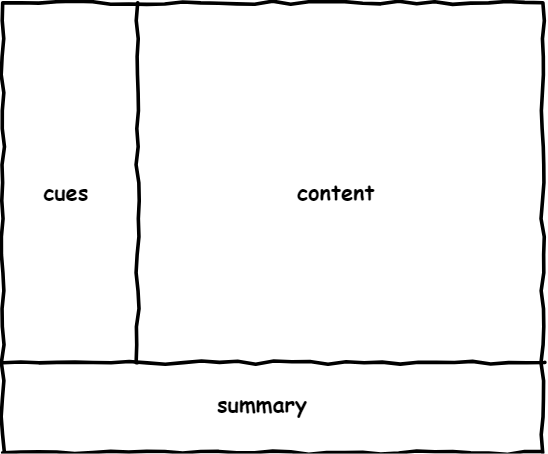
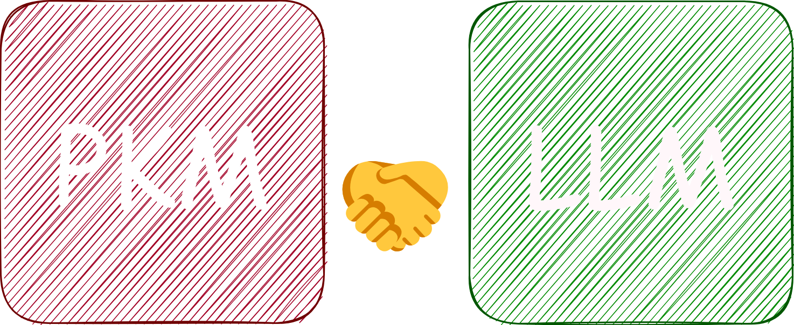
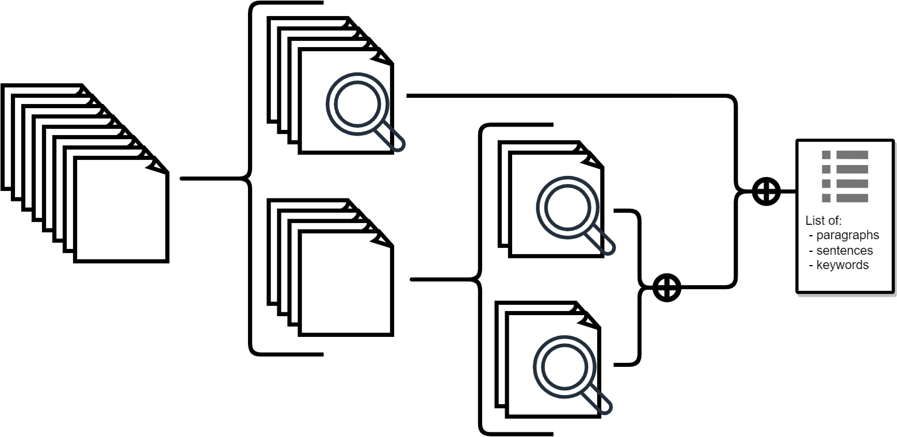

<!-- _class: lead -->

### **Construcción Incremental de Bases de Conocimiento Semi-estructuradas con Modelos de Lenguaje**

**Carlos Mauricio Reyes Escudero**
Junio de 2025

---

<!-- _header: Personal Knowledge Management -->
<!-- _footer: Note-taking: Cornell Notes -->

---

<!-- _header: Personal Knowledge Management -->
<!-- _footer: Note-taking -->

#### {placeholder para ejemplos de metodologias de toma de notas P2}

---

<!-- _header: Personal Knowledge Management -->
<!-- _footer: Personal Knowledge Base + Personal Knowledge Graph -->

---

---

<!-- _class: invert -->

---

<!-- _class: invert -->

---

<!-- _class: invert -->

# `lImporter`

Un agente autónomo para _Obsidian.md_

---

---

---

---

---

<!-- _class: invert -->

# Ejemplos

---

---

---

---

---

---

---

---

---

<!-- _class: invert -->

# Gracias.

## ¿Preguntas?